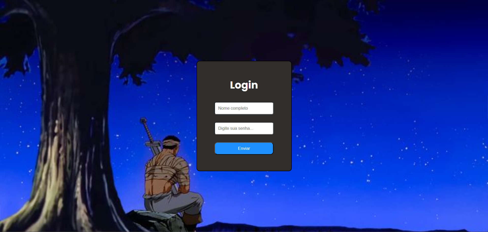

## Formulário de Loginn

[]

Projeto realizado com HTML & CSS

## Sobre

Falando sobre o projeto, foi desenvolvido com HTML e CSS, com funcionalidade de aprimorar meus conhecimentos na criação de um formulário HTML e em diversas possibilidades de projetos. A razão de realizá-lo foi ter visto um projeto semelhante, então me surgiu o interesse de recriá-lo do meu jeito e ter minhas dificuldades de pesquisar e interagir ao desenvolvê-lo.

## Dificuldades sobre..

Bem, no início tive dificuldade em questão do background, já que o projeto que eu queria realizar foi feito com um degrade de cores. Passei um bom tempo tentando realizá-lo, ao consegui-lo, obtive a fazer com outro estilo, então coloquei uma imagem de fundo, também pouca dificuldade na centralização, porém depois deu tudo certo, pois a propriedade de centralizar com flex-box é ótima.

## Aprendizagem

A aprendizagem contínua é +1 projeto investido em conhecimento e habilidades e estudos em dia.

agradeço a todos e vamos para o proxímo